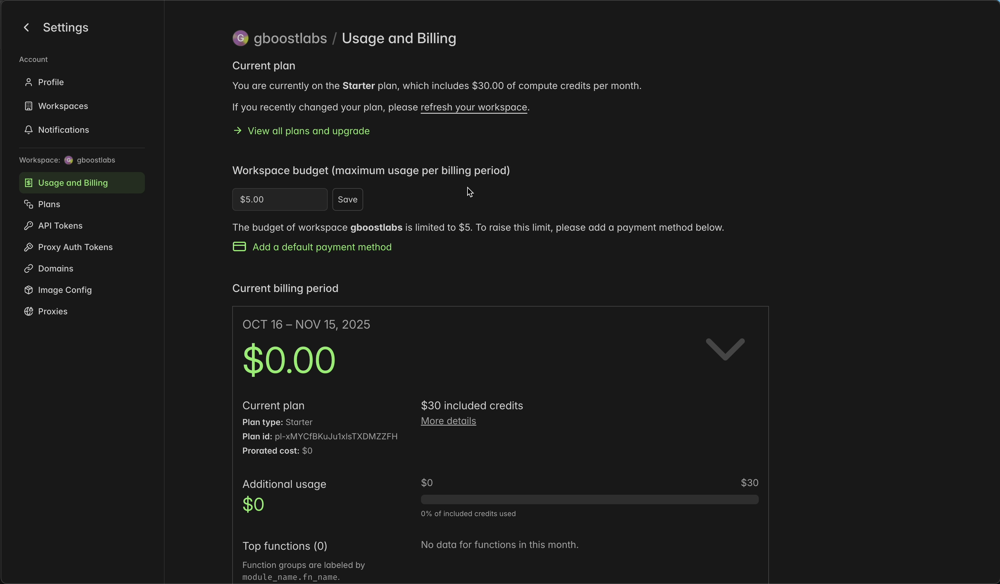

# Modal Instructions

This is meant to be a full (and quick walkthrough) for setting your Modal account. Fortunately for us, they made it super easy!

If you already have a Modal account, then you can skip this whole thing.

It's pretty intuitive, but I wanted to provide a walkthrough with screenshots as a reference to make sure people don't get stuck.

## Step 1

Go to [Modal.com](https://modal.com) to start, then click the Sign Up button at the top right corner.

## Step 2

Choose the signup option you prefer. You'll likely pick Github or Google. In this walkthrough, I selected Google.

## Step 3

Choose the account you want to use (Github account for Github signup, Google acocunt for Google signup).

## Step 4

You'll then be taken to account onboarding (which is super quick) where you just select some info to help them out in learning what you want to do with Modal.

## Step 5

Once you finish that, they show you a quickstart guide to get you started. You'll want to run `pip install modal` and `python3 -m modal setup` to authenticate your client for deployments and stuff.

## Step 6

The next and final step is to setup account billing! All you need to do is add a payment method, and you'll unlock the $30/mo free credit usage on the free plan. Most things that sound too good to be true *are* too good to be true. But this is *actually* true, and you won't be charged anything unless you use up those $30 of free credits. And you only get charged for what compute time you use!

So unless you sign up for their Team plan ($250/mo, with $100/mo in free credits and higher account limits), you won't get charged any kind of monthly fee.

## Done!

That's it! You've completed your Modal onboarding, and you're ready to start using `omnilaunch`!